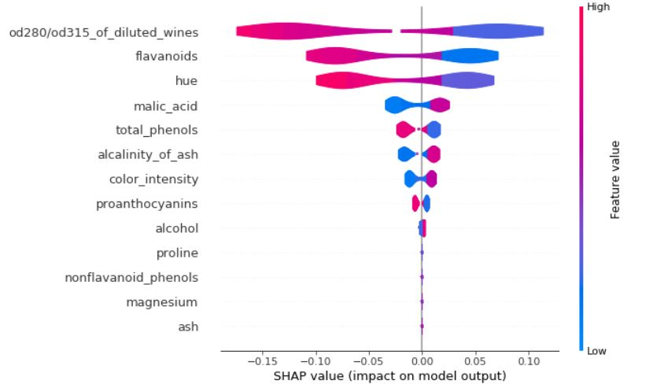

# XAI_Shap_Guide
Explaibable Artificial Intelligence on SHapley Additive exPlanations (SHAP) Guide

A guide to help explain black box models like ensemble methods. I used a random forest for this guide but SHAP can also be used to explain models using expected gradient and also deep learning models.

I used the public wine data to explain the SHAP violin plots

